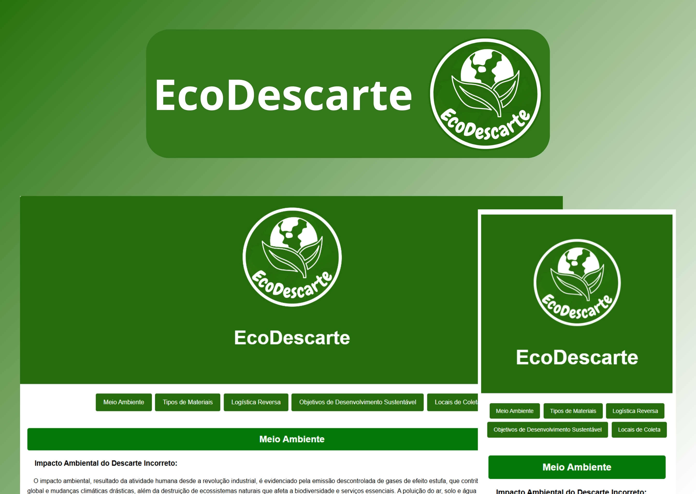

<h1 align="center"> EcoDescarte </h1>

EcoDescarte: Um projeto que te ensina a descartar e cuidar do meio ambiente.

  <a href="#-tecnologias">Tecnologias</a>&nbsp;&nbsp;&nbsp;|&nbsp;&nbsp;&nbsp;
  <a href="#-projeto">Projeto</a>&nbsp;&nbsp;&nbsp;|&nbsp;&nbsp;&nbsp;

 

  

## 🚀 Tecnologias

Esse projeto foi desenvolvido com as seguintes tecnologias:

- HTML e CSS
- JavaScript
- Git e Github

## 💻 Projeto

EcoDescarte é uma aplicação web focada na conscientização e na facilitação do descarte sustentável de resíduos. Ela oferece informações sobre o impacto ambiental do descarte incorreto, boas práticas de sustentabilidade, tipos de materiais recicláveis, logística reversa e pontos de coleta na Baixada Santista. O objetivo é educar e apoiar os usuários na busca por práticas de descarte responsáveis, promovendo o desenvolvimento sustentável.

---

Feito por Riquelme Guedes